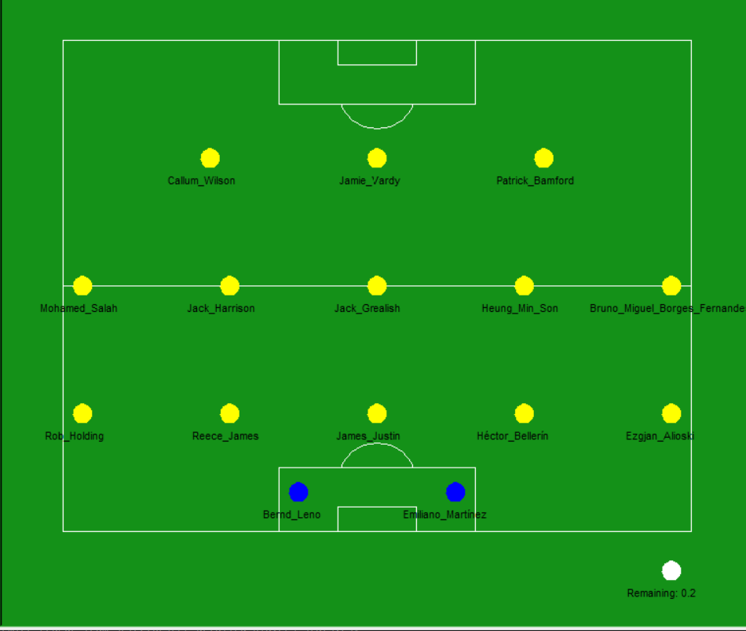
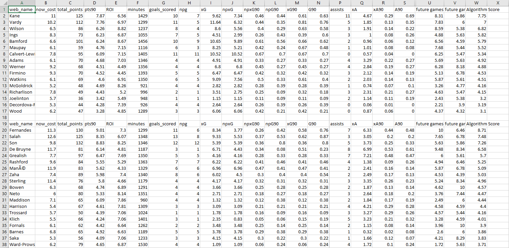

# FPL wildcard team selector

This package selects the best 15 players to choose when playing a wildcard on Fantasy premier league on any given week

  - Selects the best players by analyzing the latest data provided by the fantasy premier league API
  - creates a visualization of the selected players
  - creates a csv containing detailed stats on all the players in the premier league

### Installation

##### Using pip

You can install the package using pip by running the following:

```
pip install FPL-wildcard-team-selector
```
##### Download from source

Download the source code by cloning the [repository](https://github.com/abdul-gendy/FPL_wildcard_team_selector). Install by navigating to the proper directory and running
```
python setup.py install
```
### Usage
##### import the package
```
import FPL_wildcard_team_selector
```

##### call the play_wildcard function

This function takes in the following 4 arguments: 

  - the formation that you want to be displayed during the selection visualization. It should be one of the following: 442, 433, 343, 352
  - the minimum number of minutes that a player needs to have played in the premier league this season for him to be considered for selection
  - the number of future gameweeks to analyze
  - whether or not you want to account for penalties during the analysis

```
FPL_wildcard_team_selector.play_wildcard(formation_to_draw=433, minimum_number_of_minutes_played=600, Number_of_future_games_to_analyze=3, account_for_penalties=True)
```

### Sample Output



